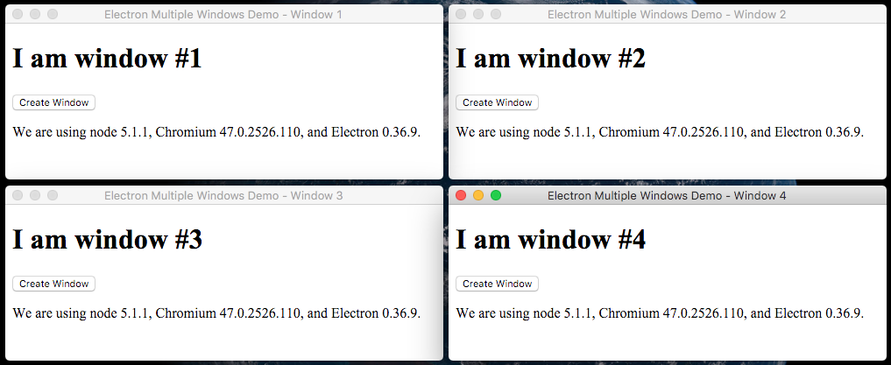

# [Electron](https://github.com/atom/electron) Multiple Windows Demo

> An example [electron](https://github.com/atom/electron) app showing how to manage multiple windows.

[![travis][travis-image]][travis-url]
[![standard][standard-image]][standard-url]

[travis-image]: https://img.shields.io/travis/ngoldman/electron-multiple-windows-demo.svg?style=flat-square
[travis-url]: https://travis-ci.org/ngoldman/electron-multiple-windows-demo
[standard-image]: https://img.shields.io/badge/code%20style-standard-brightgreen.svg?style=flat-square
[standard-url]: http://standardjs.com/



Useful things this demo app demonstrates:

- Creates an [application menu](https://github.com/atom/electron/blob/master/docs/api/menu.md) with a working `File -> New Window ⌘N` command in [`main/menu.js`](main/menu.js)
- Manages [browser window](https://github.com/atom/electron/blob/master/docs/api/browser-window.md) instances in [`main/windows.js`](main/windows.js) (list, create, destroy)
- Does some basic [inter-process communication](https://github.com/atom/electron/blob/master/docs/api/ipc-renderer.md) between [`main/windows.js`](main/windows.js) and [`renderer/index.js`](renderer/index.js)

## Try It Out

```
git clone git@github.com:ngoldman/electron-multiple-windows-demo.git
cd electron-multiple-windows-demo
npm install
npm start
```

If you want the dev tools to show up automatically when a new window opens, you can start the application in debug mode:

```
npm start -- --debug
```

## Thanks

This demo is built on top of [`electron-quick-start`](https://github.com/atom/electron-quick-start).

## License

[CC0 1.0 Universal](LICENSE.md)
